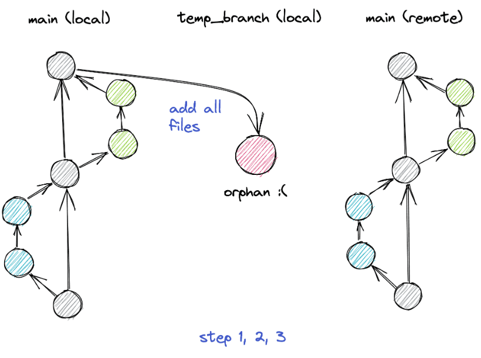
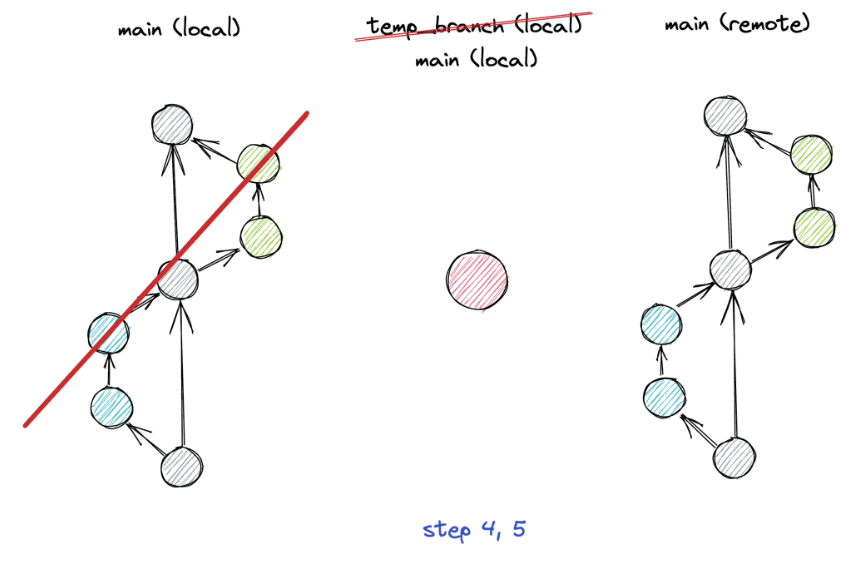
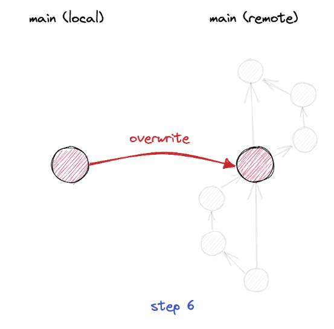

## Git Resources, Commands, Helps

### Delete All Commit History

#### Step 1: Check out to a temporary branch
Make sure your main branch is in the desired state first, as it will become the starting point of your new history. Then run
```
git checkout --orphan temp_branch
```
This command creates a new branch named temp_branch and switches to it. The --orphan option creates a branch without a commit history.

#### Step 2: Add all files

```
git add -A
```

This will stage all changes in the working directory, including deleted files.

#### Step 3: Commit the changes to the commit history
We can now commit the changes to the orphan branch using the following command:
```
git commit -m "Initial commit"
```
The result is a single commit that contains all project files.



#### Step 4: Delete the main branch
Now that we have committed the changes to the new branch, we can delete the local main branch, which contains our full commit history.
```
git branch -D main
```

#### Step 5: Rename the temporary branch to main
Next, we need to rename the temporary branch to master:
```
git branch -m main
```


#### Step 6: Force update to our Git repository
Finally, we need to force update our git repository using the following command:
```
git push --force origin main
```
The --force option allows us to overwrite the history of the remote main branch with our new local history. This option should generally be used with caution, because you risk losing work you or others committed in the past. However, for us this is the intended result



### Conclusion
Deleting the commit history of a project before publishing it on GitHub is a serious decision that should not be taken lightly. After all, you will lose all changes ever made to the project, which makes it impossible to revert to an earlier version of your codebase. It is important to consider the reasons why you want to delete the commit history and the potential impact it may have on other contributors to the project. However, if you do decide to delete the commit history, the steps outlined above can help you do it effectively and efficiently.