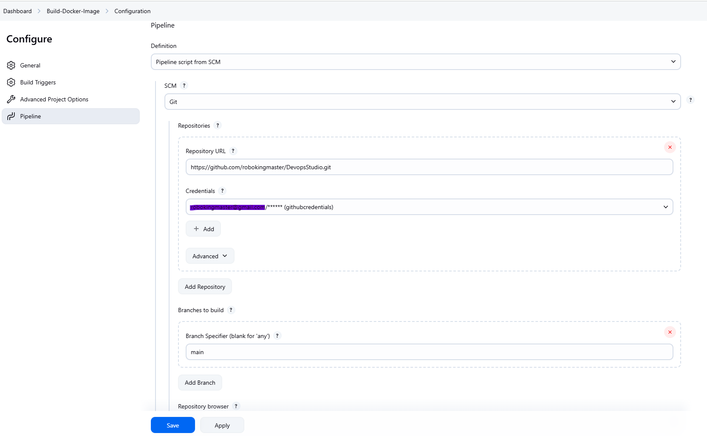

## Configuring Jenkins Server
To run the pipeline we need jenkins server lets configure ur jenkins server

Pre-Requisite:
- Host Machine with docker installed on it

Run docker container by below command

```
docker run --name jenkins -p 8080:8080 -p 50000:50000 \
-v /var/run/docker.sock:/var/run/docker.sock \
-v $(which docker):/usr/bin/docker \
-v /tmp/jenkins:/var/jenkins_home \
custom-jenkins:latest
```
Access jenkins @ http://<hostip>:8080
On first run you will see the password in logs use this password to login in to jenkins first time and setup your admin account through guided process.

### Building Docker Image
install "Docker Pipeline" plugin from Manage Jenkins -> Plugins Page
create credentials 
- For git hub 
    Type: Username with password
    ID  : githubcredentials
    User: <username>
    Password: <github password>
- For Docker Hub to push the image
    Type: Username with password
    ID  : dockerHubCredentialsId
    User: <username>
    Password: <github password>/<PAT (Personal Access Token)>
- Create Pipeline Job (Build-Docker-Image)
create pipeline job name Build-Docker-Image. Under Pipeline-Definition choose Pipeline script from SCM. In Repository section add repository URL and choose the credentials. Add branch name under branch to build and save the job as shown in below image 

